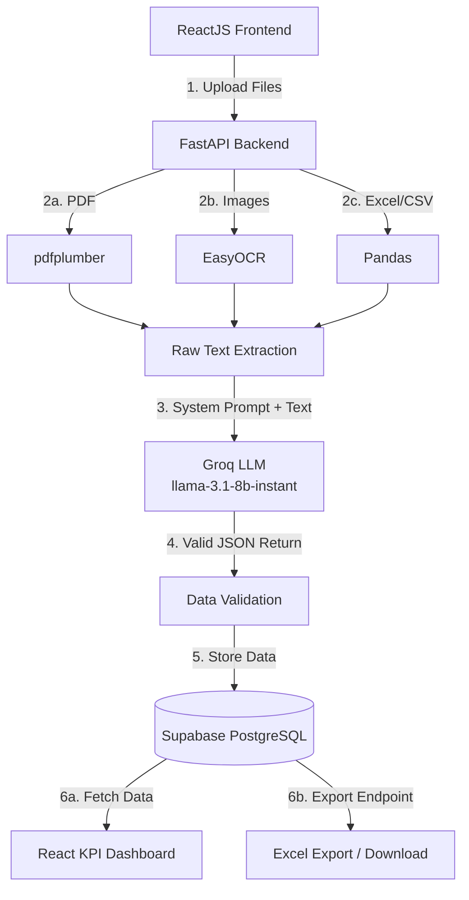

# Full Stack AI Document Consolidation System

### 🚀 Live Demo
* **Frontend Application:** [Nexus HR Analytics on Vercel](https://ai-document-consolidation-system.vercel.app/)
* **Backend API Hub:** Hosted on Hugging Face Spaces (Docker/FastAPI)
* **Database:** Supabase (PostgreSQL)

**Domain: Option 5 - Employee Churn Dataset**

This project is a Full Stack AI-powered Document Consolidation Application. It accepts multiple file formats (PDFs, Excel, CSV, Images), extracts raw text using various OCR tools, normalizes the data into a structured schema using Groq's LLM, and stores it in a PostgreSQL database for reporting and Excel export.

## 1. Architecture Diagram



## 2. Processing Flow Explanation

1. **Upload:** Users drag and drop or select multiple files (PDF, JPG, PNG, XLS, XLSX, CSV, ZIP) via the React frontend. The files are sent as `multipart/form-data` to the FastAPI backend.
2. **OCR / Text Extraction:** The backend determines the file extension and routes the file to the appropriate extraction library:
   - `pdfplumber` for PDFs
   - `Pandas` for Excel/CSV lists
   - `EasyOCR` for Image formats (JPG, PNG)
3. **LLM Structuring:** The consolidated raw string of text is sent to the Groq API (`llama-3.1-8b-instant` model). The system prompts the LLM to behave as an HR data extractor and to map the unstructured text strictly into the predetermined JSON schema.
4. **Database Storage:** The parsed, validated JSON is mapped to an SQLAlchemy model. Mandatory tracking fields like `source_file`, `upload_timestamp`, and `processing_status` are appended, and the record is saved to the PostgreSQL database (Supabase).
5. **Export & Visualization:** The React frontend automatically fetches the saved data via a GET endpoint to populate the KPI Dashboard (Total Employees, Total Churn, Churn by Department Bar Chart). Users can also generate an on-the-fly Excel `.xlsx` report download from the database.

## 3. LLM Prompt Strategy

The system utilizes a **Zero-Shot strict JSON enforcement** strategy with the `llama-3.1-8b-instant` model on Groq.

- **Explicit Schema Definition:** The prompt lists out the exact schema keys expected (`employee_id`, `joining_date`, `department`, etc.) alongside explicit data types (string, boolean, float) and formatting requirements (YYYY-MM-DD for dates).
- **Null Handling Restrictions:** It dictates exactly how the LLM should handle missing information (e.g., passing `null` rather than making up answers).
- **Format Stripping:** The system instructs the LLM not to output markdown wrappers or conversational explanations, resulting in a strictly parsable JSON string. Fallback programmatic string manipulation happens in Python to strip rogue `\```json` wrappers if they appear.

## 4. Database Schema

The extracted and normalized data is stored in the `employee_churn` table within PostgreSQL.

| Column Name               | Data Type    | Constraints/Notes                                     |
| :------------------------ | :----------- | :---------------------------------------------------- |
| `id`                      | Integer      | Primary Key, Auto-increment                           |
| `employee_id`             | String       | Indexed, Not Null                                     |
| `joining_date`            | Date         | Nullable (format YYYY-MM-DD)                          |
| `exit_date`               | Date         | Nullable (format YYYY-MM-DD)                          |
| `department`              | String       | Indexed, Nullable                                     |
| `last_performance_rating` | String       | Nullable                                              |
| `salary`                  | Float        | Nullable                                              |
| `exit_reason`             | String       | Nullable                                              |
| `churn_flag`              | Boolean      | Default False                                         |
| **`source_file`**         | String       | Mandatory Tracking Field                              |
| **`upload_timestamp`**    | DateTime(TZ) | Mandatory Tracking Field, Default NOW()               |
| **`processing_status`**   | String       | Mandatory Tracking Field (PENDING, COMPLETED, FAILED) |

## 5. Challenges Faced

- **Timezone-Aware Excel Exports in Pandas:** Pandas throws `ValueError` exceptions when attempting to export timezone-aware `datetime` objects (like our tracking `upload_timestamp`) to Excel directly. To resolve this, a pre-processing step iterates over the `datetimetz` columns in the DataFrame and converts them to timezone-naive datetimes via `dt.tz_localize(None)` prior to pushing into `io.BytesIO()`.
- **Supabase Database Pooling vs Direct Connections:** Depending on network configurations and deployment targets (local vs free-tier Supabase), connections leveraging IPv6 vs IPv4 require different connection strings or session pooling port numbers (Port 6543 vs 5432). This requires environmental variables (`DATABASE_URL`) to securely and seamlessly map the correct deployment string.

## 6. Cost Estimation

If this application was scaled to process **10,000 documents per month**:

- **Database (Supabase):** Free Tier is sufficient for < 500MB database limits. Pro upgrade ($25/mo) if volume scaling significantly increases DB row counts. ($0 - $25/mo)
- **Groq LLM (llama-3.1-8b-instant):** Extremely cost-effective and fast inference. Processing 10,000 documents at ~1000 input tokens each is roughly 10M tokens. At $0.05 / 1M input tokens, this amounts to < $5/mo.
- **Backend Compute (Render / Railway / Fly.io):** A standard basic tier with enough memory for EasyOCR/Pandas computations. (~$10 - $15/mo)
- **Frontend Hosting (Vercel):** Free Tier completely covers static React frontend bandwidth and loads. ($0/mo)

**Total Monthly Estimated Cost:** ~$15 to $45 per month depending on compute and database needs.
