# Full Stack AI Document Consolidation System

### 🚀 Live Demo

- **Frontend Application:** [HR Analytics on Vercel](https://ai-document-consolidation-system.vercel.app/)
- **Backend API Hub:** Hosted on Hugging Face Spaces (Docker/FastAPI)
- **Database:** Supabase (PostgreSQL)

**Employee Churn Dataset**

This project is a Full Stack AI-powered Document Consolidation Application. It accepts multiple file formats (PDFs, Excel, CSV, Images, ZIPs), extracts raw text using various OCR tools, normalizes the data into a structured schema using Groq's LLM with intelligent ID recovery, and stores it in a PostgreSQL database. The frontend provides a full-featured analytics dashboard with inline editing, three-tier data validation, batch operations, an AI chat assistant, and Excel export.

---

## 1. Architecture Diagram

```mermaid
graph TD
    A[ReactJS Frontend] -->|1. Upload Files| B[FastAPI Backend]
    B -->|2a. PDF| C[pdfplumber]
    B -->|2b. Images| D[EasyOCR]
    B -->|2c. Excel/CSV| E[Pandas]
    C --> F[Raw Text Extraction]
    D --> F
    E --> F
    F -->|3. System Prompt + Text| G[Groq LLM \nllama-3.1-8b-instant]
    G -->|4. JSON with validation_status| H[Programmatic ID Fill]
    H -->|5. Three-Tier Validation| I[Data Validation & Storage]
    I -->|6. Store Records| J[(Supabase PostgreSQL)]
    J -->|7a. Fetch Data| K[React KPI Dashboard]
    J -->|7b. Export Endpoint| L[Excel Export / Download]
    J -->|7c. Chat Endpoint| M[AI Chat Assistant]
    K --> N[Error Table ❌]
    K --> O[Guess Table ⚠️]
    K --> P[Master Table ✅]
```



---

## 2. Key Features

### 📤 Multi-Format Document Ingestion

- Drag-and-drop or file browser upload supporting **PDF, XLSX, XLS, CSV, JPG, PNG, ZIP**
- Real-time upload progress bar with animated status indicators
- Batch file processing with per-file error handling

### 🤖 Intelligent Data Extraction (LLM + OCR)

- **pdfplumber** for PDF text extraction
- **EasyOCR** for image-based OCR (JPG, PNG)
- **Pandas** for structured spreadsheet/CSV parsing
- **Groq LLM (llama-3.1-8b-instant)** for semantic data normalization:
  - Zero-shot JSON enforcement with strict schema mapping
  - Unix timestamp detection and conversion to `YYYY-MM-DD`
  - Currency symbol stripping and non-numeric salary handling (e.g., `"Competitive"` → `null`)
  - Semantic column mapping (e.g., `"Pay"` → `salary`, `"Dept"` → `department`)

### 🔍 Three-Tier Data Validation System

A multi-stage pipeline for handling data quality issues around employee IDs:

| Tier            | Status     | Meaning                                               | UI Treatment                              |
| :-------------- | :--------- | :---------------------------------------------------- | :---------------------------------------- |
| ✅ **Verified** | `verified` | ID was present in the original source data            | Goes directly to master table             |
| ⚠️ **Guess**    | `guess`    | ID was missing but inferred from a sequential pattern | Yellow review table with confirm/edit     |
| ❌ **Error**    | `error`    | ID was missing and could not be guessed               | Red critical table requiring manual entry |

**Two-Pass ID Recovery:**

1. **LLM Pass** — The AI attempts to infer missing IDs from context and sequential patterns
2. **Programmatic Pass** (`fill_missing_ids`) — A deterministic Python function catches anything the LLM missed by analyzing prefix/number patterns in surrounding rows (e.g., `EMP-1013`, `null`, `EMP-1015` → fills `EMP-1014`)

### ✏️ Full Inline Editing

- **Error/Guess Tables:** Click the ID or pencil icon to enter edit mode, type a corrected ID, and click Confirm to verify the record and move it to the master table
- **Master Table:** Click the edit icon on any row to make all fields editable:
  - Employee ID, Department, Exit Reason (text inputs)
  - Joining Date, Exit Date (date picker inputs)
  - Salary (number input with NaN-safe handling)
  - Performance Rating (text input)
- Save/Cancel buttons with toast notifications for success/failure

### 📊 KPI Dashboard & Analytics

- **Analyzed Profiles** card — total employee count with badge
- **Recorded Churn** card — churn count with calculated percentage rate
- **Retention by Department** stacked bar chart (Recharts) with dynamic per-department colors
- **Summary Badges** — conditionally rendered error/guess count badges below the page heading
- Responsive grid layout adapting to desktop and mobile

### 🗂️ Consolidated Records Table

- Paginated data view (5 rows per page) with Previous/Next navigation
- Search/filter by Employee ID or Department
- Sorted by employee_id with `localeCompare({ numeric: true })` for correct alphanumeric ordering
- Select-all and individual row checkboxes for batch operations
- Batch delete with confirmation dialog
- Individual row delete with confirmation
- Inline edit mode for all fields

### 💬 AI Chat Assistant

- Slide-in chat panel (right sidebar) with backdrop blur overlay
- Powered by **Groq LLM (llama-3.1-8b-instant)**
- Sends the current dashboard data as context so the AI can answer questions about your specific employee churn dataset
- Loading state with spinner animation
- Enter key to submit, disabled state during loading

### 🌗 Dark Mode

- Dark mode enabled by default
- Toggle via Sun/Moon icon in the navigation bar
- Full dark mode support across all components using Tailwind `dark:` variants
- Smooth color transitions via `transition-colors duration-200`

---

## 3. API Endpoints

| Method   | Endpoint               | Description                                                                     |
| :------- | :--------------------- | :------------------------------------------------------------------------------ |
| `GET`    | `/`                    | Root endpoint, returns welcome message                                          |
| `GET`    | `/health`              | Database health check                                                           |
| `POST`   | `/upload`              | Upload and process files (multipart/form-data)                                  |
| `GET`    | `/api/churn-data`      | Fetch all churn records as JSON                                                 |
| `PUT`    | `/api/churn-data/{id}` | Update a record (supports all fields including validation_status, is_confirmed) |
| `DELETE` | `/api/churn-data/{id}` | Delete a record by ID                                                           |
| `GET`    | `/export`              | Download all records as Excel `.xlsx`                                           |
| `POST`   | `/api/chat`            | Send a question + data context, get AI-generated HR insights                    |

---

## 4. LLM Prompt Strategy

The system utilizes a **Zero-Shot strict JSON enforcement** strategy with the `llama-3.1-8b-instant` model on Groq (`max_tokens: 8192`).

- **Explicit Schema Definition:** The prompt lists out the exact schema keys expected (`employee_id`, `joining_date`, `department`, etc.) alongside explicit data types (string, boolean, float) and formatting requirements (YYYY-MM-DD for dates).
- **Validation Status Rules:** The prompt is extremely explicit that `validation_status` is **ONLY about the employee_id column**. If a row already has an ID in the source data, it must be `"verified"` regardless of missing data in other fields. The LLM is instructed to never mark a row as `"error"` or `"guess"` if the original data already contains an employee_id for that row.
- **Null Handling:** Dictates exactly how to handle missing information (e.g., passing `null` rather than fabricating data). Non-numeric salaries like `"Competitive"` return `null`.
- **Format Enforcement:** Pure JSON array output with no markdown wrappers or explanations. Fallback regex stripping in Python catches rogue code fences if they appear.
- **Programmatic Fallback:** After the LLM pass, `fill_missing_ids()` provides a deterministic backup using prefix/number pattern detection across neighboring rows.

---

## 5. Database Schema

The extracted and normalized data is stored in the `employee_churn` table within PostgreSQL (Supabase).

| Column Name               | Data Type    | Constraints/Notes                                            |
| :------------------------ | :----------- | :----------------------------------------------------------- |
| `id`                      | Integer      | Primary Key, Auto-increment                                  |
| `employee_id`             | String       | Indexed, Not Null                                            |
| `joining_date`            | Date         | Nullable (format YYYY-MM-DD)                                 |
| `exit_date`               | Date         | Nullable (format YYYY-MM-DD)                                 |
| `department`              | String       | Indexed, Nullable                                            |
| `last_performance_rating` | String       | Nullable                                                     |
| `salary`                  | Float        | Nullable                                                     |
| `exit_reason`             | String       | Nullable                                                     |
| `churn_flag`              | Boolean      | Default False                                                |
| `validation_status`       | String       | Default `"verified"` — values: `verified`, `guess`, `error`  |
| `is_confirmed`            | Boolean      | Default True — set to False for unconfirmed guess/error rows |
| `source_file`             | String       | Mandatory Tracking Field                                     |
| `upload_timestamp`        | DateTime(TZ) | Mandatory Tracking Field, Default NOW()                      |
| `processing_status`       | String       | Mandatory Tracking Field (PENDING, COMPLETED, FAILED)        |

---

## 6. Tech Stack

### Frontend

| Technology      | Purpose                              |
| :-------------- | :----------------------------------- |
| React 18        | UI framework                         |
| Vite            | Build tool and dev server            |
| Tailwind CSS    | Utility-first styling with dark mode |
| Recharts        | Data visualization (bar charts)      |
| Axios           | HTTP client for API requests         |
| react-dropzone  | Drag-and-drop file upload            |
| lucide-react    | Icon library (20+ icons used)        |
| react-hot-toast | Toast notifications                  |

### Backend

| Technology    | Purpose                              |
| :------------ | :----------------------------------- |
| FastAPI       | REST API framework                   |
| SQLAlchemy    | ORM for database operations          |
| Groq SDK      | LLM inference (llama-3.1-8b-instant) |
| pdfplumber    | PDF text extraction                  |
| EasyOCR       | Image OCR                            |
| Pandas        | Excel/CSV parsing and export         |
| Pydantic      | Request/response validation          |
| python-dotenv | Environment variable management      |

### Infrastructure

| Service             | Purpose                         |
| :------------------ | :------------------------------ |
| Vercel              | Frontend hosting (free tier)    |
| Hugging Face Spaces | Backend hosting (Docker)        |
| Supabase            | PostgreSQL database (free tier) |

---

## 7. Processing Flow

1. **Upload:** Users drag-and-drop or select multiple files via the React frontend. Files are sent as `multipart/form-data` to the FastAPI backend.
2. **OCR / Text Extraction:** The backend routes each file to the appropriate extraction library based on file extension.
3. **LLM Structuring:** The raw text is sent to Groq's LLM with explicit schema instructions and validation_status rules.
4. **Programmatic ID Fill:** After LLM parsing, `fill_missing_ids()` scans for any remaining null/error IDs and attempts to fill them using sequential number patterns from neighboring rows.
5. **Three-Tier Sorting:** Records are classified as `verified` (master table), `guess` (yellow review table), or `error` (red critical table) based on `validation_status`.
6. **Database Storage:** Validated JSON is mapped to an SQLAlchemy model with tracking fields (`source_file`, `upload_timestamp`, `processing_status`) and saved to PostgreSQL.
7. **Dashboard Rendering:** The React frontend auto-fetches data and renders KPI cards, department chart, validation tables, and the sortable master table.
8. **User Review:** Users confirm/edit guessed IDs and manually enter missing IDs. Confirmed rows move to the master table in sorted order.

---

## 8. Challenges Faced

- **LLM Inconsistency with ID Guessing:** The LLM would sometimes mark rows with existing IDs as `"error"` because other fields (like salary) were missing. Solved with extremely explicit prompting that `validation_status` is ONLY about the `employee_id` column, plus a deterministic Python fallback (`fill_missing_ids`) for reliable sequential gap-filling.
- **Token Limit Truncation:** Large datasets (25+ employees) caused the LLM response to be cut off mid-JSON at the default 1024 max_tokens. Increased to 8192 to accommodate large payloads.
- **Pydantic Null Rejection (422 Errors):** Using bare types like `salary: float = None` in Pydantic models caused 422 errors when the frontend sent explicit `null` values. Fixed by using `Optional[float] = None` for all UpdateRecord fields.
- **Legacy Records Disappearing:** Records uploaded before the validation system was added had `null` for `validation_status`, causing them to fall through all three filters. Fixed by treating `null`/missing validation_status as `"verified"`.
- **Timezone-Aware Excel Exports:** Pandas throws `ValueError` on timezone-aware `datetime` objects during Excel export. Resolved with a pre-processing step that strips timezone info via `dt.tz_localize(None)`.
- **Supabase Connection Pooling:** IPv6 vs IPv4 and pooling port differences (6543 vs 5432) require careful `DATABASE_URL` configuration per deployment target.

---

## 9. Cost Estimation

If this application was scaled to process **10,000 documents per month:**

- **Database (Supabase):** Free Tier is sufficient for < 500MB. Pro upgrade ($25/mo) if scaling significantly. ($0 - $25/mo)
- **Groq LLM (llama-3.1-8b-instant):** 10,000 documents at ~1000 input tokens each = ~10M tokens. At $0.05 / 1M input tokens, this amounts to < $5/mo.
- **Backend Compute (Hugging Face Spaces):** Free tier for basic usage, upgraded Spaces for heavier OCR workloads. ($0 - $15/mo)
- **Frontend Hosting (Vercel):** Free Tier covers static React frontend. ($0/mo)

**Total Monthly Estimated Cost:** ~$5 to $45 per month depending on compute and database needs.

---

## 10. Local Development

### Backend

```bash
cd backend
pip install -r requirements.txt
# Create .env with GROQ_API_KEY and DATABASE_URL
uvicorn main:app --reload
```

### Frontend

```bash
cd frontend
npm install
npm run dev
# Runs on http://localhost:5173
```

> **Note:** When developing locally, the API base URLs are updated in `App.jsx` from `https://nknair-hr-intelligence-backend.hf.space` to `http://127.0.0.1:8000`.
